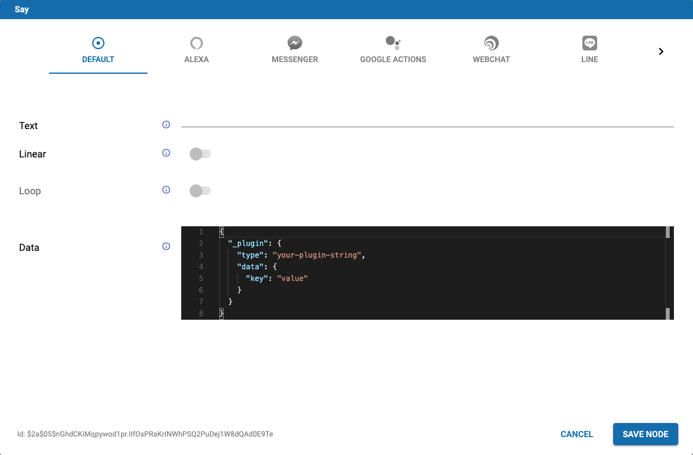

# Webchat Plugins
With Cognigy 3.3 you have the ability to include any software plugins in your webchat. 

We distinguish two types of plugins:
* **input** 
* **message**

The first ones are displayed in the input bar of your webchat, such as the **Send** or **Microphone** button. The second are displayed as a text message written by the Cognigy Bot. 

# Contents
* Message Plugins
  * Examples
    * Simple Plugin
    * Return JSX
    * Get Cognigy Webchat Style
    * Fullscreen Plugin
* Open Plugin in Cognigy.AI


### Message Plugins
A Message Plugin is used to 

If you want to develop your own message plugin you have to follow these steps: 
* Create a folder for your plugin
* Create a file called **index.tsx** 
	* You don’t have to use Typescript at this point but we recommend using it 

#### Guide: Your first Message Plugin

##### Write a simple Message Component
In it's core, a Message Plugin is made up of a React component that gets the message it should display via `props` and decides how to render it. This `SimpleMessageComponent` just renders a `<div>` containing the message's text.

```javascript
const SimpleMessageComponent = (props) => {
    const text = props.message.text;

	return (
        <div>{text}</div>
    );
}
```

##### Create a simple Message Plugin
Now that we have a component that renders the message, we can use that to declare a Webchat Message Plugin.
```javascript
const simpleMessagePlugin = {
    match: 'simple-message',
    component: SimpleMessageComponent
}
```
When included in the Webchat, this Plugin will be used whereever a message arrives where `message.data._plugin.type` equals `'simple-message'`. The rest of the messages will be be ignored by this Plugin.


##### Registering the simple Message Plugin
In order to register the Message Plugin to the Cognigy Webchat, it needs to be put at a certain place the Cognigy Webchat looks at when starting up.
```javascript
if (!window.cognigyWebchatMessagePlugins) {
    window.cognigyWebchatMessagePlugins = [];
}
window.cognigyWebchatMessagePlugins.push(simpleMessagePlugin);
```

##### Wrapping up


```javascript
import * as React from 'react';

// create a message component
const SimpleMessageComponent = (props) => {
    const text = props.message.text;

	return (
        <div>{text}</div>
    );
}

// create a plugin
const simpleMessagePlugin = {
    match: 'simple-message',
    component: SimpleMessageComponent
}

// register the plugin
if (!window.cognigyWebchatMessagePlugins) {
    window.cognigyWebchatMessagePlugins = [];
}
window.cognigyWebchatMessagePlugins.push(simpleMessagePlugin);
```


#### Example: Rating Interaction
You can use the `onSendMessage` method from the props to send a message to the bot.
It will appear on the user side of the chat, such as if the user had written it by himself.
The message text is defined by your plugin code, you can add a data-object as the second parameter.
```javascript
const SenderComopnent = (props) => {
    return (
        <div>
            <button onClick={() => props.onSendMessage('👍')}>
            👍
            </button>
            <button onClick={() => props.onSendMessage('👎')}>
            👎
            </button>
        </div>
    )
}
```

#### Example: Using custom match rules
Instead on relying on the convention of using `message.data._plugin.type === 'your-plugin-name'`, you can also define a custom function to match messages for your plugin. it will get the message as an argument and should return a boolean value whether it fits the message or not.

```javascript
// this will match any message where the message text contains 'reverse'
const matchReverseText = (message) => message.text.includes('reverse');

const reversePlugin = {
    match: matchReverseText
    component: ReverseTextComponent
}


// this will match any message from the user
const matchUserMessage = (message) => message.source === 'user';

const userMessagePlugin = {
    match: matchUserMessage,
    component: UserMessageComponent
}
```


Such as always, you have to return your [JSX](https://reactjs.org/docs/introducing-jsx.html)  code who looks like HTML but is translated to Javascript in the background. You could for example return a simple button which sends a message in the name of the user: 
```javascript
const MessageComponent = (props) => {
    const { onSendMessage } = props;

    const handleClick = () => {
        onSendMessage('I clicked the button')
    }

    return (
        <button onClick={handleClick}>Click me!</button>
    );
}
```

If the user clicks the button which is displayed by the plugin, the user writes the message _I clicked the button_. 

The method **onSendMessage()** is passed as a props parameter and is used to send a message in the name of the user back to the webchat.

##### Get Cognigy Webchat Style
Since the design is an important part, you can use the webchat’s styles in your plugin, such as the primary color. Therefore you have to import [message plugins](https://github.com/Cognigy/Clients/blob/master/packages/webchat/src/common/interfaces/message-plugin.ts) from the Cognigy interfaces: 
```javascript
import { MessageComponentProps, MessagePluginFactory } from "../../../common/interfaces/message-plugin";
```

Now you have to define a styled constant as your main part: 
```javascript
const yourStyledPlugin = ({ styled }) => {

	// style your plugin components here

  class YouPlugin extends React.Component {
		// write your plugin code here
		render() {
			return(
				<div></div>
			);
		}
	}
}

registerMessagePlugin(yourStyledPlugin);
export default yourStyledPlugin;
```

The constant **yourStyledPlugin** gets the **styled** property and uses the **MessagePluginFactory**.

If you want to give your plugin’s button the style of your whole webchat, you can easily define a new component: 
```javascript
// style your plugin components here
const PrimaryButton = styled.button(({ theme }) => ({
    background: theme.primaryColor,
    color: theme.primaryContrastColor,
    padding: `${theme.unitSize * 2}px ${theme.unitSize * 3}px`,
}));
```

The theme gives you various style options, such as **primaryColor** or **primaryContrastColor** to design your components straight forward. 
The code `theme.unitSize * 2` is used to take advantage of the theme’s style for scaling reasons. Therefore your plugin scales automatically in the webchat’s window. We highly recommend using these **unitSizes** in your code to always offer a perfect design. After this, you can use the new component **PrimaryButton** in your **render()** method: 
```javascript
render() {
	return (
		<PrimaryButton>Click me!</PrimaryButton>
	);
}
```

##### Fullscreen Plugin
Until now, the plugin only renders a simple button but for some reasons it should render a fullscreen plugin, such as the Date/- or Flightseatpicker. The only important thing is, that the user should for example click on a button to open the fullscreen plugin since you should offer the possibility to write the answer as a message — in the Datepicker the user can open the picker or write the whished date.

For this you can use the property method **onSetFullscreen** which could be called by the **PrimaryButton** at the **onClick** event.
```javascript
const { onSetFullcreen } = this.props;

render() {
	return (
		<Primarybutton onClick={onSetFullscreen}>Click me!</PrimaryButton>
	);
}
```

###### Advanced
If you want to check if the plugin currently is in fullscreen mode, you can use the boolean property **isFullscreen**: 
```javascript
const { isFullscreen } = this.props;

if (isFullscreen) {
	console.log("is fullscreen");
}else{
	console.log("is not fullscreen");
}
```


### Open Plugin in Cognigy.AI

If you're finished with developing your plugin, you need to execute it in your Cognigy.AI Flow to let the user interact with it. For that, you only have to send a **Data Message** via **Say Node**, such as the following example: 

```json
{
  "_plugin": {
    "type": "your-plugin-string",
    "data": {
      "key": "value"
    }
  }
}
```

The entire **Say Node** now looks like this: 



With `_plugin.type` the webchat knows which plugin you want to execute since you defined it with this string in your plugin's code. Within the `data` object you define all needed information for your plugin — for example you could send the name of the **Click me!** button as `clickButton: "Click me!"`. 

###### Advanced

If you want to make things easier than sending a data message, you can develop a [Cognigy Custom Module](<https://github.com/Cognigy/CustomModules>) which simply sends a **Data Message** via the following JavaScript command: 

```javascript
// send the message to open your plugin
input.actions.output("", {
	_plugin: {
		type: "your-plugin-string",
		data: {
			key: args.value,
		}
	}
});
```

Note that you now need the users input which is stored in the `args` to define your data's values. The whole Custom Node could look like this (example in TypeScript): 

```javascript
/**
 * Opens your Plugin in the Chat
 * @arg {CognigyScript} `key` The key of your data
 */
async function yourPluginCustomNode(input: IFlowInput, args: { key: string }) {
    // Check if secret exists and contains correct parameters
    if (!args.key) return Promise.reject("No key value defined.");

    // send the message to open datepicker
    input.actions.output("", {
        _plugin: {
            type: "your-plugin-string",
            data: {
                key: args.key
            }
        }
    });
}

module.exports.yourPluginCustomNode = yourPluginCustomNode;
```

